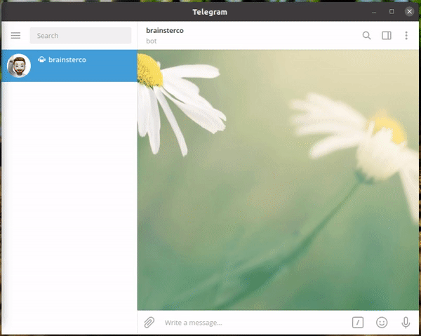
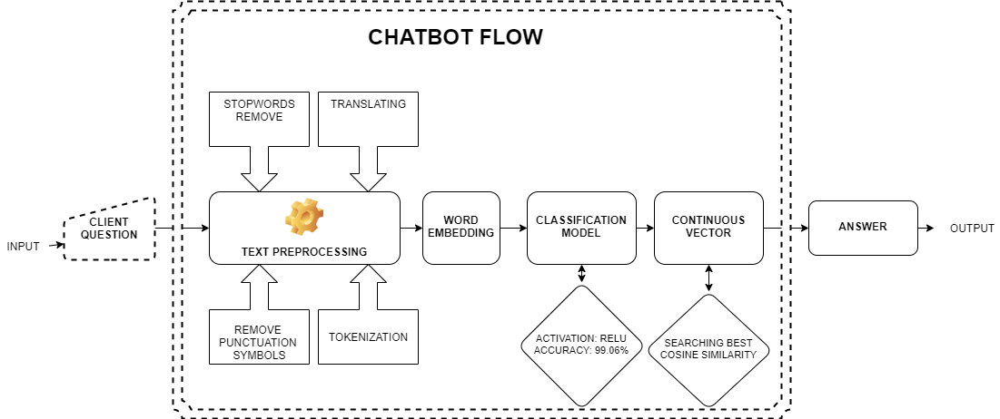
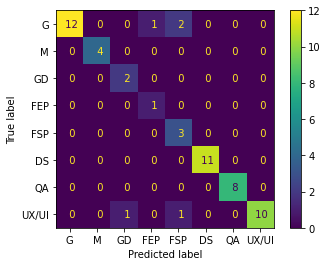

# Brainster Chatbot - Rubik

## Content
- [Description](#description)
- [How does it work?](#howdoesitwork)
- [Project/Chat Architecture](#architecture)
	- [Data and Dataset Generation](#dataset)
	- [Dataset Preprocessing](#preprocessing)
	- [Classification Model Traning](#training)
	- [Responding to Questions](#responding)
	- [NLP Techniques Used](#nlpused)
	- [Clasification Algorithms Used](#classused)
- [Summary of results & benchmark](#benchmark)
- [Requirements](#requirements)
- [Team members](#team)
- [Special Thanks](#thanks)

## Description 
Brainster's Chatbot Rubik is a machine learning based conversational dialog engine build in Python and its libraries which makes it possible to generate responses based on collections of known conversations. The main purpose of the Brainster Chatbot is asnwering questions to visitors of the [website](https://brainster.co/) and [Facebook business page](https://www.facebook.com/brainster.co). Questions may be related with all academies, courses and bootcapms organized by Brainster. Moreover, you can get more familiar with all departments that one day you will be part of it.

## How does it work? 
Once active, the Chatbot starts to communicate. Each time a user enters a query, the bot provides an appropriate response based on its training. The bot accepts queries in Macedonian, and responds in Macedonian. Input should preferably be in Cyrillic in order to maximize the quality of the answers. Latin inputs are automatically converted into Cyrillic, but such a case some characters/combinations of characters could be transliterated wrongly.

| Rubik in Action |
| :----: |
|  |

## Project/Chat Architecture 

### *Data and Dataset Generation* 
Dataset generation started with an set of 300+ questions asked by people which Brainster had received via email or social media. All questions were classified into 8 classes, 7 of which related to an Academy offered by Brainster (Digital Marketing, Graphical Design, Data Science, Front-end Programming, Full-stack Programming, Software  Testing, UX/UI), and one class for general questions. The initial set of questions was expanded by more than tenfold (to 3100+ questions), by writing new, or by rewriting existing questions with slightly modified wording in order to capture the nuances (question diversification).

### *Dataset Preprocessing* 
The questions in the dataset were individually processed as described in the process outlined further.

1. Any latin characters in the question were converted to cyrillic characters.
2. Punctuation and stop-words were removed from the question, and the question was then tokenized.
3. The question was vectorized using [word-embedding](https://nlp.h-its.org/bpemb/). The output vector has of dimesion 300.

The final outcome is a dataset of 300-by-1 vectors paired with their resprective class. A classification model is then trained on this set.

### *Classification Model Traning* 
Several classification models were trained and tested before deciding which one to use. Early on during the testing it became evident that Random Forest classifier, XGBoost classifier, and a neural network based classifier performed best (no worse than low 90% on any validation accuracy), while the other classifiers performed somewhat worse (Naive Bayes, k-Nearest Neighbors, Gradient Boost, ADA Boost; validation accuracy in the high 80%). The final decision was to use the classifier based on neural networks which has been performing at validation accuracy of 99.06%.

Apart from these models, we tested the performance of the [BERT pre-trained language model](https://github.com/google-research/bert). Its performance was only slightly worse than our own approach.

### *Responding to Questions* 
User input queries are processed in the same manner as described in Dataset Preprocessing. Once the query is transformed in the required input form, the following process takes place.

1. The query is classified into one of the 8 classes outlined above. 
2. Using the classification from the previous step, cosine similarity is used to determine what question in the appropriate class is closest to the input query.
3. Finally, the answer to the question identified in the prevous step is produced as a response to the user query.

The user interface of the method is implemented in [Telegram](https://telegram.org/).

### *NLP Techniques Used* 
The following natural language processing techniques were tried and tested:

- [ ] CountVectorizer
- [ ] TF-IDF
- [ ] TF-IDF ngrams
- [x] Word Embedding
- [ ] BERT

### *Clasification Algorithms Used* 
The following classification methods were tried and tested:

- [ ] RandomForest
- [ ] XGBoost
- [ ] NaiveBayes
- [ ] KNN
- [x] Neural Networks

## Summary of results & benchmark 
| Class         | precision | recall  | f1-score  | support  |
| ------------- |:---------:| :------:| :--------:| :-----:|
| **G**         | 1.00      | 0.80    | 0.89      | 15 |
| **M**         | 1.00      |   1.00  |   1.00    |   4 |
| **GD**        | 0.67      |   1.00  |   0.80    |   2 |
| **FEP**       | 0.50      |    1.00 |    0.67   |    1 |
| **FSP**       | 0.50      |    1.00 |    0.67   |    3 |
| **DS**        | 1.00      |    1.00 |    1.00   |    11 |
| **QA**        | 1.00      |    1.00 |    1.00   |    8 |
| **UX/UI**     | 1.00      |    0.83 |    0.83   |    12 |
| accuracy      |           |         | 0.91      | 56 |
| macro avg     | 0.83      |   0.95  |   0.87    |   56 |
| weighted avg  | 0.95      |   0.91  |   0.92    |   56 |

On benchmark we selected 56 questions randomly from usres who send mails, comments etc. Accuracy on classifing this questions was 91% and we can see that if sample was bigger in some classes accuracy will go over actual score.
On the other hand benchmark on continius vector on overal result without classification was 80.64%.

## Requirements 
Check [this list](requirements.txt) for details about modules and versions used in this implementation.

## Team members 
[Contribution guidelines for this project](CONTRIBUTING.md)

* [Martina Nestorovska](https://www.linkedin.com/in/martina-nestorovska-b367ba8/)
* [Gabriela Bonkova](https://www.linkedin.com/in/gabriela-bonkova-a25607194/)
* [Filip Nikolovski](https://www.linkedin.com/in/filip-nikolovski-a26559ab/)
* [Aleksandar Gjurcinoski](https://www.linkedin.com/in/aleksandar-gjurcinoski-7594a242/)
* [Stefan Krstevski] (https://www.linkedin.com/in/stefan-krstevski-027ab0161)

## Special Thanks to our mentor Kiril Cvetkov 

Да се проверат прашањата
Да се направи chit-chat

